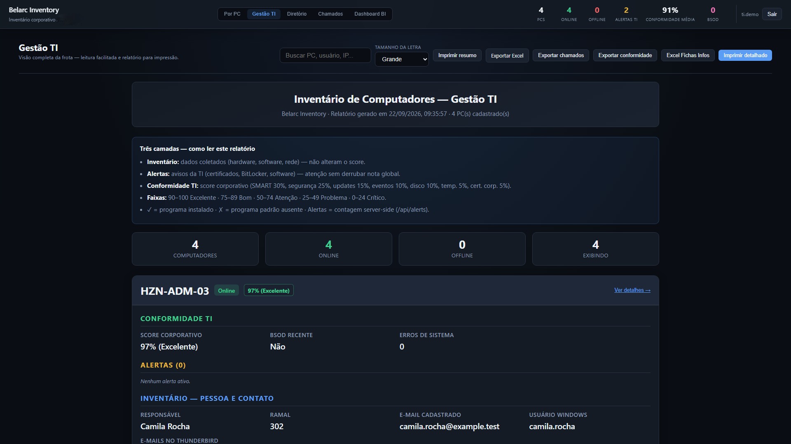
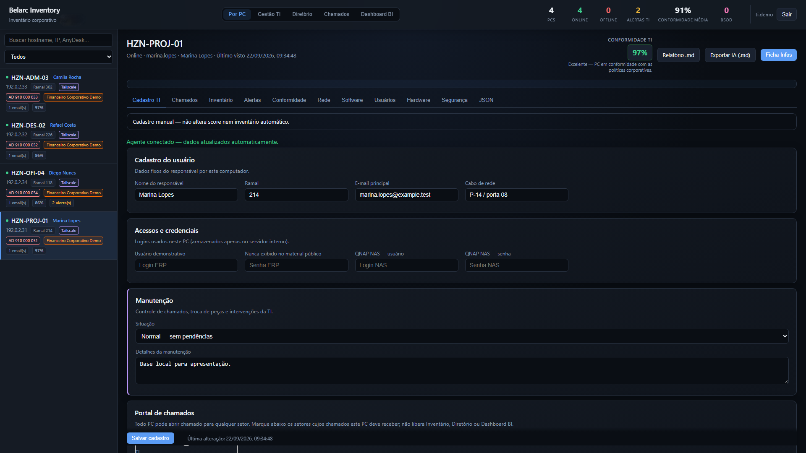
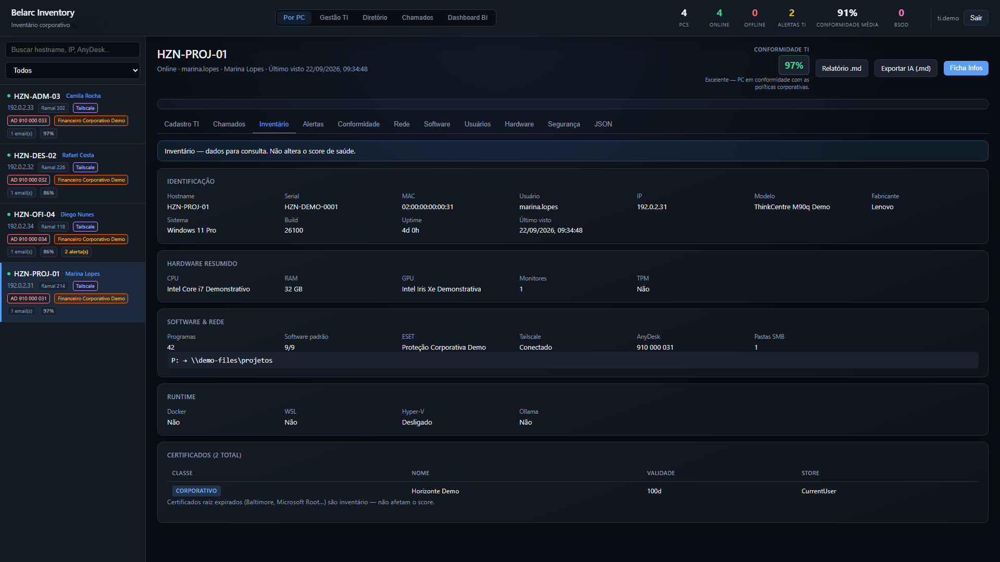
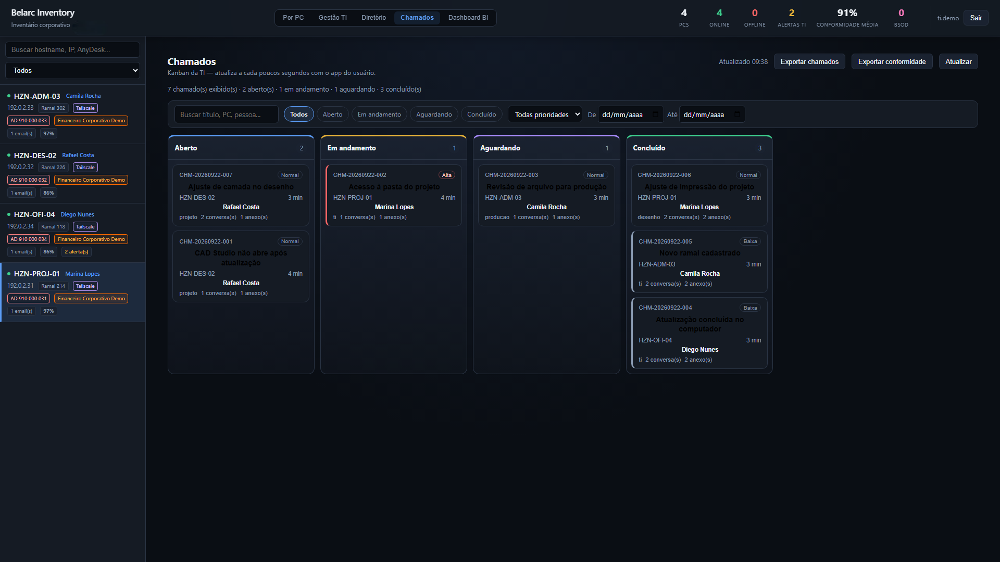
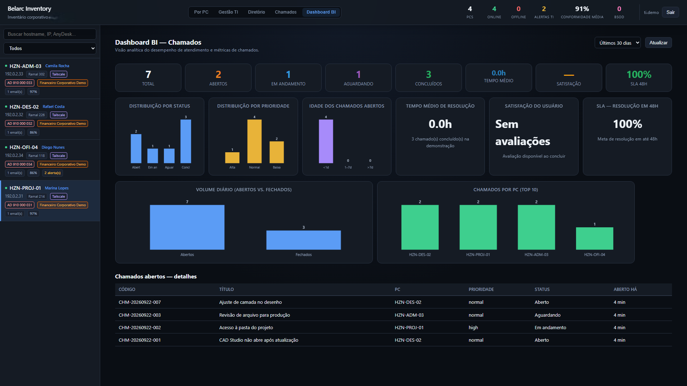
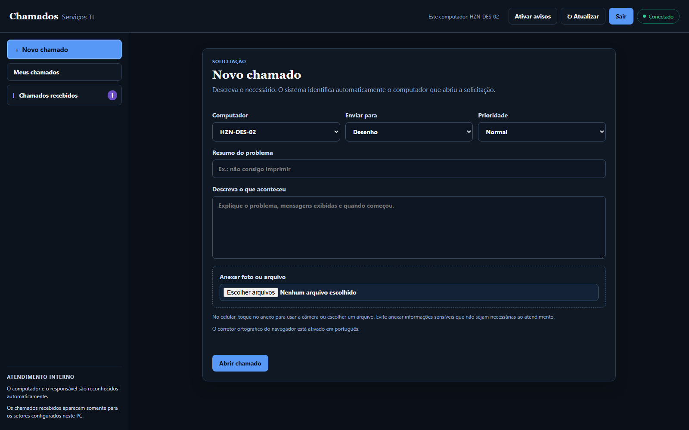
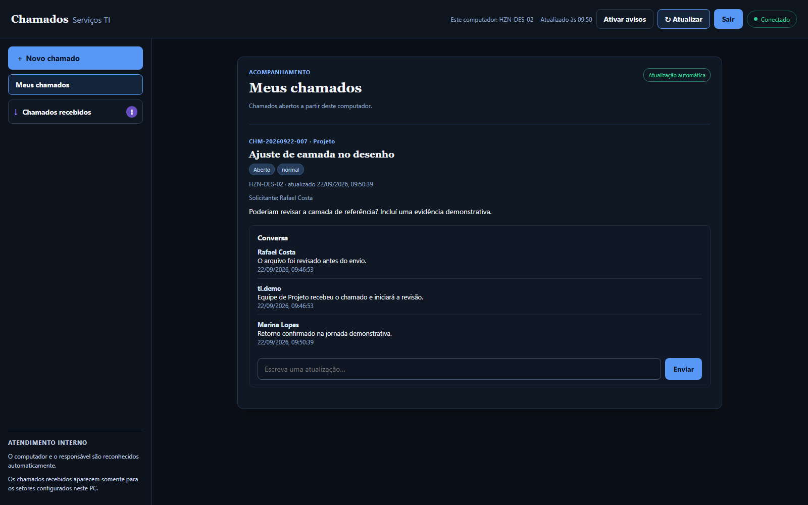
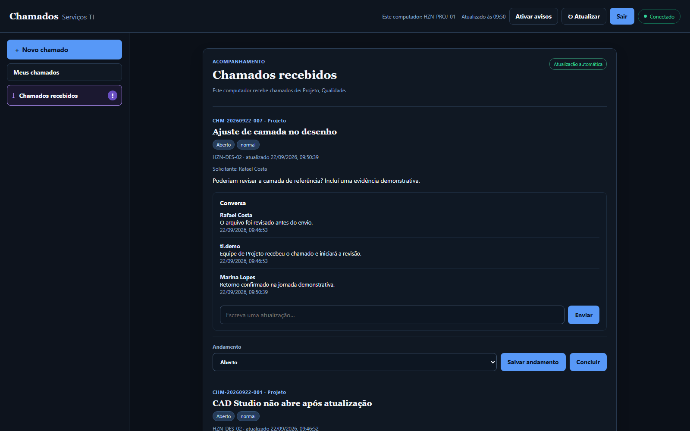

# Belarc Inventory

[](https://github.com/Mayconxzdev/Belarc-Inventory/actions/workflows/ci.yml)
[](#requisitos)
[](#arquitetura)
[](LICENSE)

> Inventário e operação de TI para redes privadas: transforma a coleta contínua de estações Windows em contexto para suporte, auditoria e decisão.
>
> **Estado atual:** sistema em uso interno na empresa onde atuo. As telas públicas usam dados fictícios e foram sanitizadas para não expor nomes, endereços, inventário, credenciais ou informações operacionais reais.

<p align="center">
  
</p>

## O problema que motivou o projeto

Uma máquina pode parecer apenas um nome em uma lista até o momento em que falha, muda de responsável, precisa ser substituída ou entra em uma auditoria. Nesse ponto, a equipe precisa descobrir rapidamente o que existe naquele PC, qual é seu estado, quem o utiliza, quais riscos já foram observados e se há histórico de atendimento.

O **Belarc Inventory** foi construído por [Maycon Ferreira](https://github.com/Mayconxzdev) e [Diogo Rodrigues](https://www.linkedin.com/in/diogorj) para reduzir essa dependência de planilhas, memória operacional e conferências manuais. O sistema reúne inventário, saúde técnica, cadastro administrativo e chamados no mesmo contexto do computador.

O projeto é voltado a ambientes Windows em **LAN/VPN privada** e está em operação interna. Ele não é um produto de exposição pública na internet e não possui vínculo com a Belarc Inc.; o nome é apenas uma referência histórica ao domínio de inventário de TI.

## O que o sistema entrega

| Frente | O que acontece na prática |
| --- | --- |
| **Inventário contínuo** | Um agente Windows coleta hardware, software, rede, usuários, certificados, eventos e informações de segurança. |
| **Contexto por computador** | A TI visualiza responsável, ramal, e-mail de contato, referências operacionais, manutenção e histórico técnico em uma única ficha. |
| **Saúde e conformidade** | O servidor transforma coletas em indicadores, alertas e uma leitura de conformidade para priorização. |
| **Chamados por setor** | O solicitante abre e acompanha tickets no contexto do próprio PC; setores configurados recebem, conversam, anexam evidências e atualizam o andamento. |
| **Gestão e relatórios** | A equipe consulta a frota, filtros, diretório, Kanban, Dashboard BI e exportações operacionais. |
| **Instalação por papel** | Há componentes separados para servidor, agente, estação de TI e usuário final, sem expor o inventário ao usuário comum. |

## Visão do produto

### 1. Gestão da frota e contexto operacional

<p align="center">
  
</p>

Além de listar dispositivos, a gestão concentra o que costuma ser procurado durante um atendimento: situação online, alertas, conformidade, responsável, ramal, usuário Windows e informações de inventário.

### 2. Cadastro da TI e roteamento de chamados por PC

<p align="center">
  
</p>

Cada computador pode receber chamados de um ou mais setores — como TI, Desenho, Projeto ou Produção — sem conceder acesso ao inventário para quem apenas atende a fila daquele setor.

### 3. Coleta técnica da estação

<p align="center">
  
</p>

O agente em Rust executa coletores PowerShell/CIM e envia mudanças ao servidor. A ficha organiza informações de hardware, software, rede, usuários, certificados, segurança e eventos para leitura operacional.

### 4. Atendimento centralizado para a TI

<p align="center">
  
</p>

O Kanban permite filtrar, priorizar e acompanhar chamados. A origem do ticket permanece ligada ao computador e ao solicitante, evitando perder o contexto técnico ao longo do atendimento.

### 5. Dashboard BI para priorização

<p align="center">
  
</p>

O Dashboard BI resume volume, status, prioridades e acompanhamento operacional, apoiando decisões sem substituir a investigação detalhada na ficha de cada PC.

### 6. Portal simples para quem abre o chamado

<table>
  <tr>
    <td width="50%"></td>
    <td width="50%"></td>
  </tr>
</table>

O usuário final não precisa navegar pelo painel técnico: ele abre um chamado, escolhe o setor responsável, descreve a necessidade, anexa evidências e acompanha conversas, respostas, anexos e conclusão a partir do contexto do computador instalado.

### 7. Fila recebida pelo setor configurado

<p align="center">
  
</p>

Um PC configurado para atender um setor recebe apenas a fila correspondente. Assim, uma máquina de Projeto pode tratar chamados de Projeto, enquanto a TI continua com a visão completa de inventário, conformidade e operação.

> Todas as imagens deste repositório usam dados fictícios, endereços reservados para documentação e cenários de demonstração.

## Decisões e trade-offs

- Separei agente Windows, servidor e telas por papel: quem atende um chamado recebe o contexto necessário, enquanto a administração do inventário continua com a equipe de TI.
- Mantive o produto em rede privada e com SQLite para atender ao uso interno atual. Isso simplifica a implantação neste contexto, mas uma expansão para várias unidades exige reavaliar identidade e persistência centralizada.
- O cache e o último contato da estação ajudam a diagnosticar falhas de conectividade; eles apoiam o suporte, mas não substituem uma plataforma de observabilidade.

## Arquitetura

```text
┌───────────────────────────── PC Windows ─────────────────────────────┐
│  BelarcPC                                                            │
│  Rust + coletores PowerShell/CIM                                     │
│  inventário · rede · segurança · certificados · eventos              │
└───────────────────────────────┬──────────────────────────────────────┘
                                │ HTTP interno + token de agente
                                ▼
┌──────────────────────── Servidor LAN/VPN ────────────────────────────┐
│  BelarcServidor: Axum + SQLite                                       │
│  API · persistência · alertas · conformidade · anexos · auditoria    │
└───────────────┬──────────────────────────────────────┬──────────────┘
                │                                      │
                ▼                                      ▼
┌───────────────────────────────┐      ┌────────────────────────────────┐
│ Estação TI                     │      │ Portal do usuário/setor         │
│ inventário · diretório · BI    │      │ chamados do próprio contexto     │
│ cadastro · Kanban · gestão     │      │ conversa · anexos · recebimento  │
└───────────────────────────────┘      └────────────────────────────────┘
```

### Componentes

| Componente | Responsabilidade |
| --- | --- |
| `BelarcServidor` | Servidor, banco SQLite local, API, painel, Dashboard BI e conta administrativa de TI. |
| `BelarcPC` | Agente da estação Windows, responsável pela coleta e comunicação periódica. |
| `BelarcTISetup` | Atalhos e ferramentas para a estação da equipe de TI. |
| `BelarcClienteSetup` | Portal simples de chamados para solicitantes e equipes que recebem chamados. |

## Segurança por padrão e limites conhecidos

- O projeto é destinado exclusivamente a **LAN/VPN privada**. Não publique o servidor diretamente na internet.
- A emissão de matrículas de agentes exige sessão autenticada de TI.
- A matrícula de um novo agente é de uso único e expira em 24 horas.
- O portal comum é limitado ao contexto do computador e aos setores configurados; não deve ser usado para expor inventário ou dados administrativos.
- Senhas de ERP, compartilhamentos, NAS ou aplicativos não são armazenadas por esta edição pública.
- Bancos SQLite, tokens, anexos, logs, certificados, perfis locais e dados coletados não devem entrar no Git.
- Instalações corporativas antigas que tenham armazenado credenciais exigem backup e migração manual; esta edição não executa limpeza destrutiva automática.

Consulte o [modelo de segurança e reporte responsável](SECURITY.md) antes de implantar.

## Executar uma demonstração local

### Requisitos

- Windows 10/11 ou Windows Server;
- PowerShell 5.1 ou superior;
- Rust estável com `cargo`;
- Git.

```powershell
git clone https://github.com/Mayconxzdev/Belarc-Inventory.git
cd Belarc-Inventory
.\scripts\qa\isolated-smoke-test.ps1 -Build
```

O smoke test cria um ambiente descartável com perfil fictício, banco local, tickets de demonstração e compartilhamento simulado em `test-data\isolated`. Ele não instala serviços Windows, não cria tarefas agendadas e não acessa NAS ou rede corporativa.

## Compilar e validar

```powershell
cargo fmt --all -- --check
cargo clippy --workspace --all-targets -- -D warnings
cargo test --workspace
cargo build --workspace
.\scripts\qa\assert-public-tree.ps1
```

O repositório não distribui binários ou GitHub Releases nesta fase. O caminho suportado é a compilação local, seguida de homologação física em uma rede controlada antes de qualquer distribuição de instaladores.

## Implantar em uma LAN/VPN privada

1. Ajuste [`config/company-profile.json`](config/company-profile.json) com dados da sua organização e mantenha valores reais fora do Git.
2. Defina a URL LAN/VPN do servidor, o diretório de dados, a subnet autorizada e a conta inicial da TI.
3. Instale/inicie `BelarcServidor` no computador ou servidor escolhido.
4. Autentique-se como TI, emita uma matrícula de agente e instale `BelarcPC` nas estações usando a URL e o token emitidos.
5. Use `BelarcTISetup` para a equipe de TI e `BelarcClienteSetup` nos PCs dos usuários/atendentes.
6. Execute a homologação em duas máquinas reais antes de promover qualquer build para uso operacional.

Leia o [guia de implantação LAN/VPN](docs/deployment-lan.md) antes de usar o sistema em uma rede real.

## Qualidade e publicação segura

O CI executa, em cada push e pull request:

- formatação Rust;
- Clippy sem avisos;
- testes do workspace;
- build Windows do servidor, agente e instaladores;
- smoke test isolado;
- varredura que bloqueia referências internas e artefatos sensíveis.

Antes de publicar alterações, execute:

```powershell
.\scripts\qa\assert-public-tree.ps1
```

## Documentação complementar

- [Guia de implantação em LAN/VPN](docs/deployment-lan.md)
- [Catálogo de coletores](docs/collectors-catalog.md)
- [Perfil corporativo fictício](config/company-profile.json)
- [Dados de inventário de demonstração](docs/demo/inventory-sample.json)
- [Política de segurança](SECURITY.md)

## Autoria

Desenvolvido em parceria por **Maycon Ferreira** e **Diogo Rodrigues**.

## Licença

Distribuído sob a licença [MIT](LICENSE).
